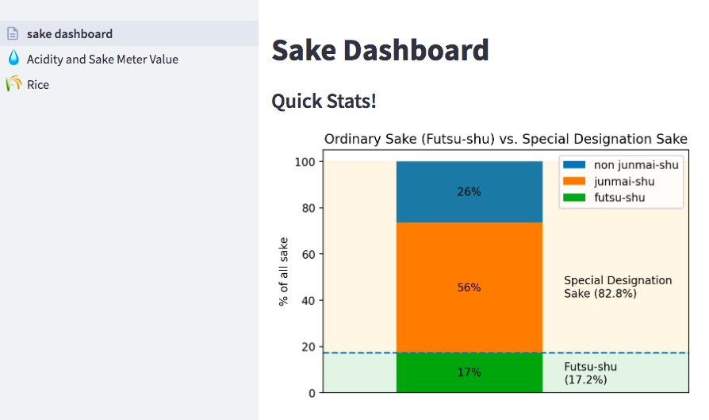

## Sake Dashboard

Learn about the regional differences of sake made in Japan with this interactive dashboard.

Click [here](https://share.streamlit.io/sevans47/sake_dashboard/sake_dashboard.py) to view the dashboard.

## Tools used

- BeautifulSoup: collect the data via webscraping
- Pandas: clean and organize the scraped data
- Google Maps Geocoding API: get coordinates of sake breweries
- Folium: create maps
- Streamlit: create the dashboard

## Data collection

The data used to create this dashboard was scraped from nihonshu.wiki using BeautifulSoup. Information for more than 14,000 different sakes was collected.

## Creating maps

The base map was created using a GeoJSON file of the Japanese prefectures, which I used with Folium to create choropleth maps of the regions of Japan.

## Web app

The web app was made using Streamlit and is a work in progress.

finished:
- acidity analysis
- gravity analysis

to do:
- sake variety analysis
- rice type analysis
